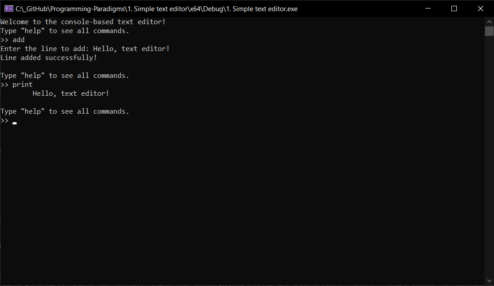
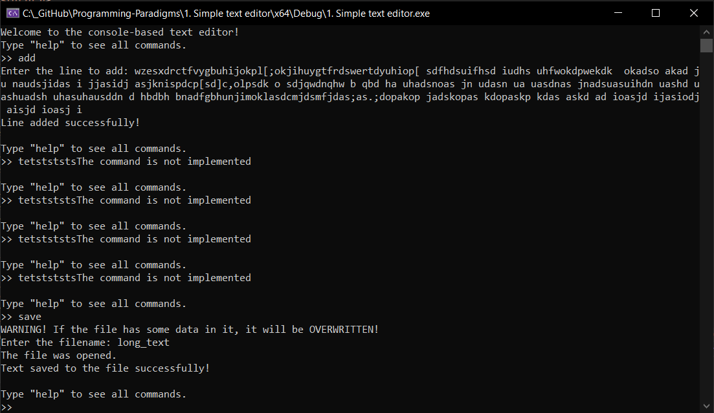
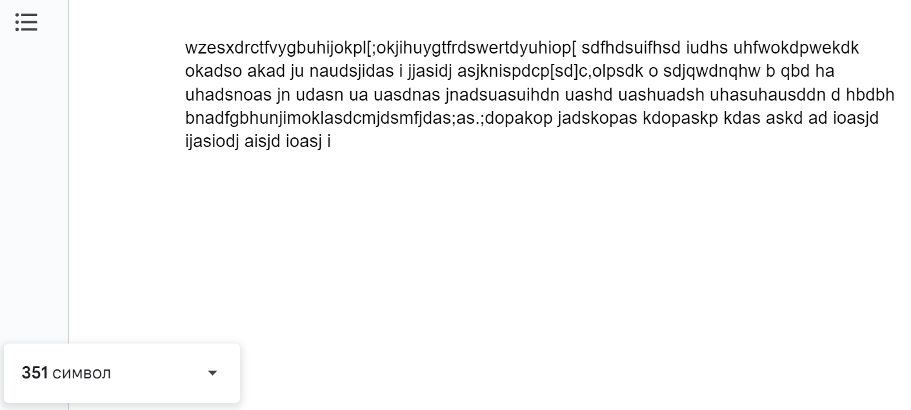
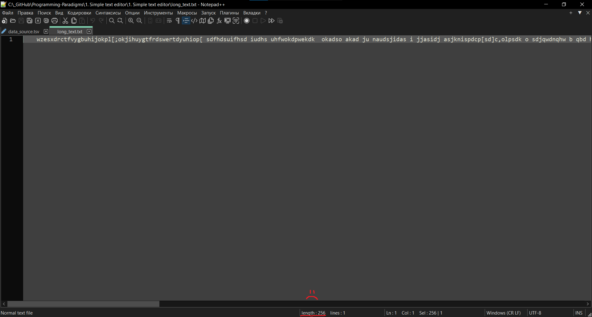
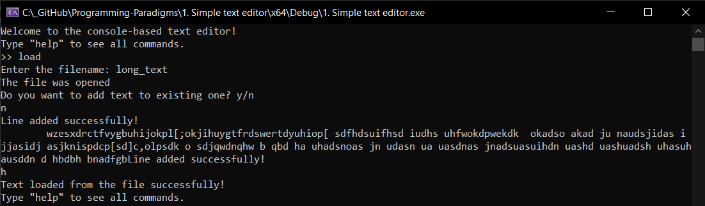
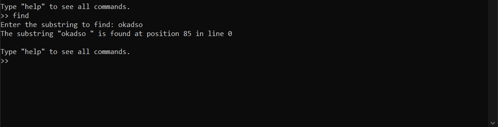

# Tests for Console-Based Text Editor

This section provides several tests to ensure the functionality of the console-based text editor. Each test demonstrates a specific feature and the expected outcome.

## Test 1: Adding and Printing Text

**Description**: Add a simple line of text and print it.

**Steps**:
1. Start the text editor.
2. Enter the `add` command.
3. Input the text: `Hello, text editor!`
4. Enter the `print` command.

**Output**:



## Test 2: Adding Long Text and Saving to File

**Description**: Add a very long line of text and save it to a file.

**Steps**:
1. Start the text editor.
2. Enter the `add` command.
3. Input a very long text (e.g., 300 characters).
4. Enter the `save` command.
5. Provide a filename: `long_text`

**Output**:


Ok, test failed. Shift happens... 😭



## Test 3: Loading Text from File

**Description**: Load text from an existing file.

**Steps**:
1. Start the text editor.
2. Enter the `load` command.
3. Provide a filename: `long_text`

**Output**:



## Test 4: Finding a Substring

**Description**: Find a substring in the text.

**Steps**:
1. Start the text editor.
2. Enter the `find` command.
3. Provide a substring: `text`

**Output**:

(substring from the previous text)

## Test 5: Handling Empty Input

**Description**: Handle empty input and print the text.

**Steps**:
1. Start the text editor.
2. Enter the `add` command.
3. Input an empty text.
4. Enter the `print` command.

**Expected Output**:
```sh 
>> add
Enter the line to add:
Line added successfully!
>> print
*emptiness*
>>
```
## Conclusion

These tests cover basic and advanced functionalities of the text editor, including adding, printing, saving, loading, finding, inserting text, and handling edge cases. Running these tests will ensure the program works as expected and is robust against various inputs.
