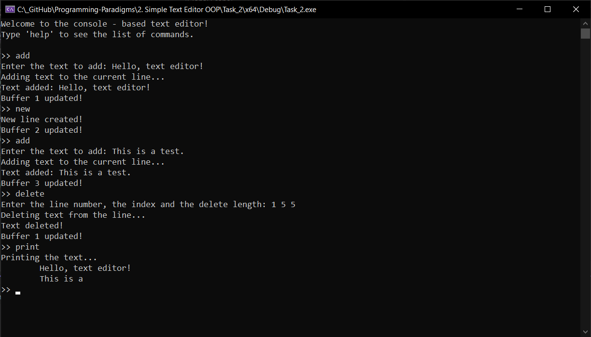
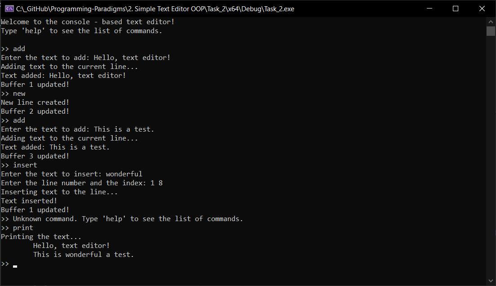
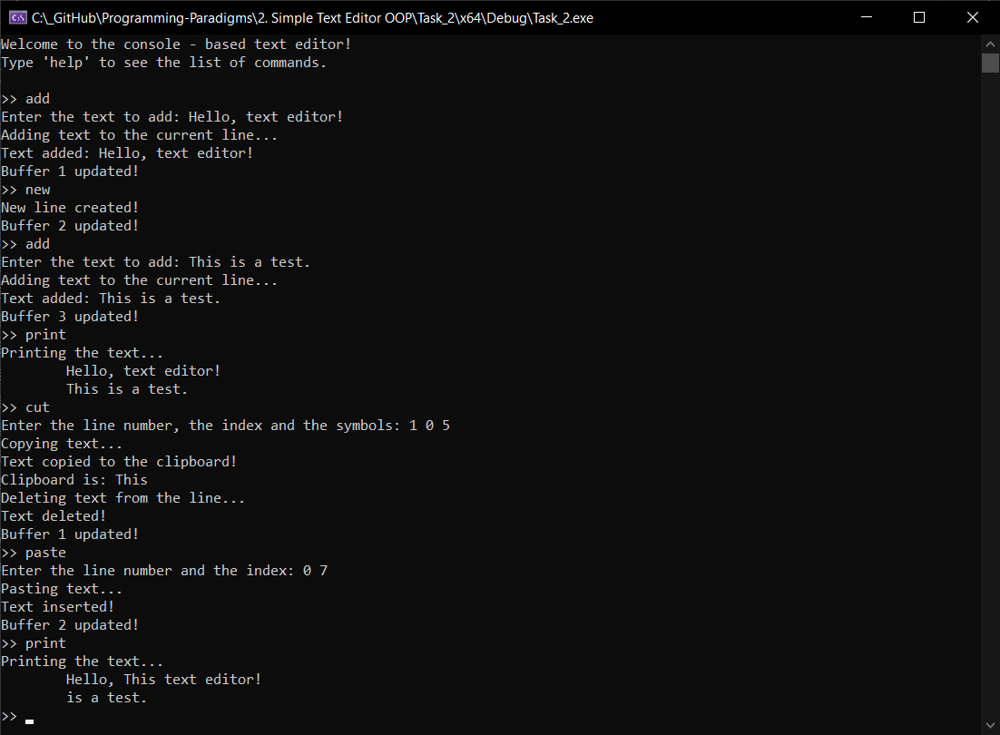
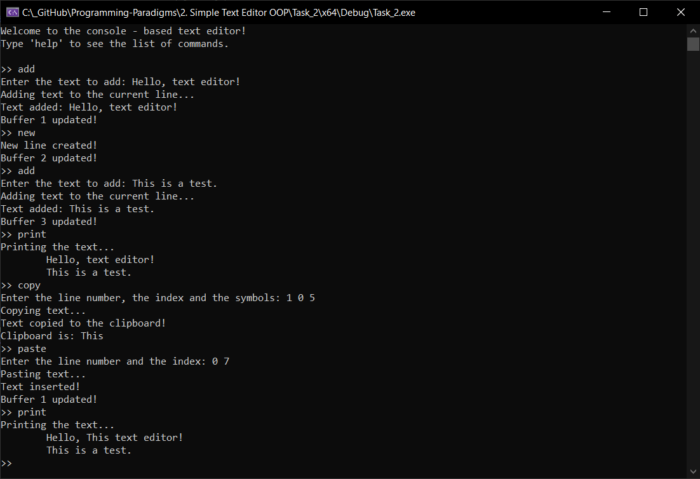
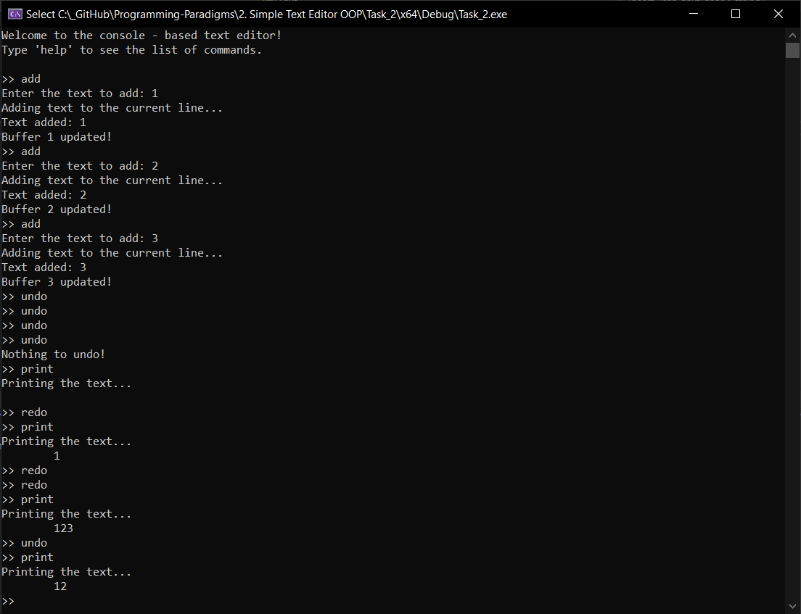

# Tests for Console-Based Text Editor 👾

This section provides several tests to ensure the functionality of the console-based text editor. Each test demonstrates a specific feature and the expected outcome.

## Overview 👀

This console-based text editor is implemented using Object-Oriented Programming (OOP) paradigm, which ensures modularity and reusability of the code. The core classes include `Line`, `Text`, and `BufferText`, each responsible for specific functionalities of the editor.

## Test 1: Deleting Text

**Description**: Delete a specific portion of text from a line.

**Steps**:
1. Start the text editor.
2. Add the text: `Hello, text editor!`
3. Create a new line.
4. Enter the `add` command again.
5. Add the text: `This is a test.`
6. Enter the `delete` command.
7. Provide the line number: `1`, index: `5`, and delete length: `5`
8. Enter the `print` command.

**Output**:

## Test 2: Inserting Text at a Specific Position

**Description**: Insert a line of text at a specific position within an existing line.

**Steps**:
1. Start the text editor.
2. Enter the `add` command.
3. Input the text: `Hello, text editor!`
4. Enter the `new` command to create a new line.
5. Enter the `add` command again.
6. Input another line of text: `This is a test.`
7. Enter the `insert` command.
8. Provide the line number: `1`, index: `8`, and input the text: `wonderful `
9. Enter the `print` command.

**Output**:

## Test 3: Cutting and Pasting Text

**Description**: Cut a specific portion of text from one line and paste it into another line.

**Steps**:
1. Start the text editor.
2. Enter the `add` command.
3. Input the text: `Hello, text editor!`
4. Enter the `new` command to create a new line.
5. Enter the `add` command again.
6. Input another line of text: `This is a test.`
7. Enter the `cut` command.
8. Provide the line number: `1`, index: `0`, and symbols: `5`
9. Enter the `paste` command.
10. Provide the line number: `0`, index: `7`
11. Enter the `print` command.

**Output**:

## Test 4: Copying and Pasting Text

**Description**: Copy a specific portion of text from one line and paste it into another line.

**Steps**:
1. Start the text editor.
2. Enter the `add` command.
3. Input the text: `Hello, text editor!`
4. Enter the `new` command to create a new line.
5. Enter the `add` command again.
6. Input another line of text: `This is a test.`
7. Enter the `copy` command.
8. Provide the line number: `1`, index: `0`, and symbols: `5`
9. Enter the `paste` command.
10. Provide the line number: `0`, index: `7`
11. Enter the `print` command.

**Output**:

## Test 5: Undoing and Redoing Actions

**Description**: Undo and redo the last action.

**Output**:

## Conclusion

These tests cover additional functionalities of the text editor, including deleting, inserting, cutting, copying, pasting text, and handling undo/redo actions. Running these tests will ensure the program works as expected and is robust against various inputs.
