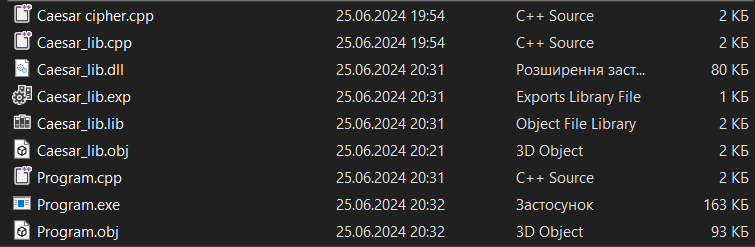

# 🦶 Step-by-Step Algorithm for Compiling and Linking Files in C++

## Step 1: Open Command Prompt and Navigate to the Folder

First, open the Command Prompt and navigate to the folder where your C++ files are located. You can do this by using the `cd` command to change the directory.

```cmd
cd C:\_GitHub\Programming-Paradigms\3. Caesar Encryption Algorithm
```

## Step 2: Set Up the Visual Studio Environment and Compile `Caesar_lib.cpp`

Run the Visual Studio Developer Command Prompt and compile the `Caesar_lib.cpp` file. This step sets up the environment variables needed for compiling C++ code using the Visual Studio tools.

```cmd
cmd /c ""C:\Program Files\Microsoft Visual Studio\2022\Community\Common7\Tools\VsDevCmd.bat" && cd C:\_GitHub\Programming-Paradigms\3. Caesar Encryption Algorithm && cl /c /EHsc Caesar_lib.cpp"
```

### 📝 Description

- `VsDevCmd.bat` initializes the Visual Studio command line environment.
- `cl` is the command-line compiler.
- `/c` flag compiles the code without linking.
- `/EHsc` flag specifies exception handling model.

## Step 3: Compile `Program.cpp`

Similarly, compile the `Program.cpp` file.

```cmd
cmd /c ""C:\Program Files\Microsoft Visual Studio\2022\Community\Common7\Tools\VsDevCmd.bat" && cd C:\_GitHub\Programming-Paradigms\3. Caesar Encryption Algorithm && cl /c /EHsc Program.cpp"
```

### 📝 Description

This command follows the same structure as the previous step, compiling the `Program.cpp` file without linking.

## Step 4: Attempt to Link and Build `Program.exe`

Now, attempt to link and build the `Program.exe` file from `Program.cpp`.

```cmd
cmd /c ""C:\Program Files\Microsoft Visual Studio\2022\Community\Common7\Tools\VsDevCmd.bat" && cd C:\_GitHub\Programming-Paradigms\3. Caesar Encryption Algorithm && cl /EHsc Program.cpp /link"
```

### 📝 Description

- This command compiles and links `Program.cpp`.
- The `/link` flag tells the compiler to perform the linking step.

### Step 4.1: Check for Errors

Check if `Program.exe` was created successfully. There should be an error indicating that the linking failed because it couldn't find the necessary symbols from `Caesar_lib.cpp`.

```cmd
.\Program.exe
```

## Step 5: Create a Dynamic Link Library (DLL) from `Caesar_lib.obj`

Create a DLL from the compiled object file `Caesar_lib.obj`.

```cmd
cmd /c ""C:\Program Files\Microsoft Visual Studio\2022\Community\Common7\Tools\VsDevCmd.bat" && cd C:\_GitHub\Programming-Paradigms\3. Caesar Encryption Algorithm && cl /LD Caesar_lib.obj /link"
```

### 📝 Description

- `/LD` flag indicates that a DLL should be created.
- This step links `Caesar_lib.obj` to produce `Caesar_lib.dll`.

## Step 6: Check the Exports of the DLL

Verify the exports of the created DLL to ensure that it has been properly compiled and linked.

```cmd
cmd /c ""C:\Program Files\Microsoft Visual Studio\2022\Community\Common7\Tools\VsDevCmd.bat" && cd C:\_GitHub\Programming-Paradigms\3. Caesar Encryption Algorithm && dumpbin.exe /exports Caesar_lib.dll"
```

### 📝 Description

- `dumpbin.exe` is a Visual Studio tool that displays information about binary files.
- `/exports` flag lists the exports from the specified DLL.

### 📸 Screenshot of Compiled and Linked Files
The following screenshot shows all the files after compiling and linking the C++ code. It includes the source files (.cpp), object files (.obj), the executable (.exe), and the dynamic link library (.dll) along with its export library (.exp) and import library (.lib).



## You're Done! ✅

You have successfully compiled and linked the C++ files using the Visual Studio command-line tools. The resulting `Program.exe` file should now be able to use the functions from the `Caesar_lib.dll` dynamic link library.