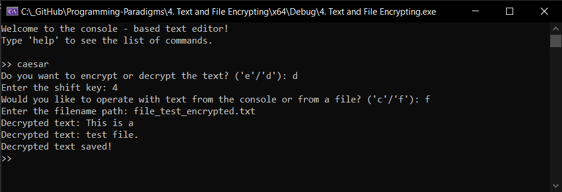

# Tests for Caesar Cipher Logic 🔐

This section provides several tests to ensure the functionality of the Caesar cipher logic. Each test demonstrates a specific feature and the expected outcome.

## Overview 👀

The Caesar cipher functionality is implemented using a separate class `CaesarCipher`. This class provides methods for encryption and decryption of text using a shift key. The logic is integrated with the text editor to allow encryption and decryption of text either from the console or from files.

## Test 1: Encrypting Text

**Description**: Encrypt a piece of text in console using a shift key.

**Steps**:
1. Start the text editor.
2. Enter the `add` command.
3. Input the text: `Hello, World!`
4. Enter the `caesar` command.
5. Choose `e` for encryption.
6. Enter the shift key: `3`
7. Choose `c` for console text.
8. Enter the `print` command.

**Expected Output**:
- The encrypted text should be displayed in the console.
- The text should be shifted by 3 positions (e.g., `Hello, World!` -> `Khoor, Zruog!`).

## Test 2: Decrypting Text

**Description**: Decrypt a piece of encrypted text in console using the same shift key.

**Steps**:
1. Start the text editor.
2. Enter the `add` command.
3. Input the encrypted text: `Khoor, Zruog!`
4. Enter the `caesar` command.
5. Choose `d` for decryption.
6. Enter the shift key: `3`
7. Choose `c` for console text.
8. Enter the `print` command.

**Expected Output**:
- The decrypted text should be displayed in the console.
- The text should revert back to its original form (e.g., `Khoor, Zruog!` -> `Hello, World!`).

## Test 3: Encrypting Text from a File

**Description**: Encrypt text from a file using a shift key.

**Steps**:
1. Create a text file `file_test.txt` with the content: `This is a test file.`
2. Start the text editor.
3. Enter the `caesar` command.
4. Choose `e` for encryption.
5. Enter the shift key: `4`
6. Choose `f` for file text.
7. Provide the file path: `file_test.txt`
8. Enter the `print` command.

**Expected Output**:
- The encrypted text should be saved in a new file `file_test_encrypted.txt`.
- The content of the file should be shifted by 4 positions (e.g., `This is a test file.` -> `Xlmw mw e xiwx jmqi.`).

## Test 4: Decrypting Text from a File

**Description**: Decrypt text from a file using the same shift key.

**Steps**:
1. Start the text editor.
2. Enter the `caesar` command.
3. Choose `d` for decryption.
4. Enter the shift key: `4`
5. Choose `f` for file text.
6. Provide the file path: `file_test_encrypted.txt`
7. Enter the `print` command.

**Expected Output**:
- The decrypted text should be saved in a new file `file_test_decrypted.txt`.
- The content of the file should revert back to its original form (e.g., `Xlmw mw e xiwx jmqi.` -> `This is a test file.`).

## Test 5: Handling Invalid Inputs ❌

**Description**: Ensure the program handles invalid inputs gracefully.

**Steps**:
1. Start the text editor.
2. Enter the `caesar` command.
3. Choose an invalid option (e.g., `x`).
4. Enter the shift key: `-1` (negative number).
5. Enter an empty text.

**Expected Output**:
- The program should display appropriate error messages for invalid choices.
- Negative shift keys should be handled or rejected.
- Empty text should not cause any crashes.

## Conclusion

These tests cover the core functionalities of the Caesar cipher logic, including encryption, decryption, and handling of invalid inputs. Running these tests will ensure the program works as expected and is robust against various inputs.
